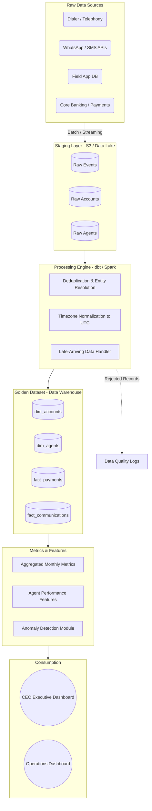

# Production Analytics Architecture

This diagram outlines how the analytical system will operate in production on a daily basis.

## Production Design Notes
- **Data Contracts**: Upstream APIs must enforce schema validation. Any schema changes (like `schema_version` in telephony) trigger alerts rather than silently breaking downstream.
- **Primary Keys & Deduplication**: Incremental processing models will upsert on primary keys (`payment_reference`, `borrower_id`) to naturally handle retries and duplicates.
- **Timezones**: All events are normalized to UTC at the staging layer. Dashboards apply local timezone formatting on the client side.
- **Monitoring**: Anomaly detection runs on the `Aggregated Monthly Metrics` layer to catch sudden drops in the denominator (active accounts) or spikes in duplicate payment hashes.
