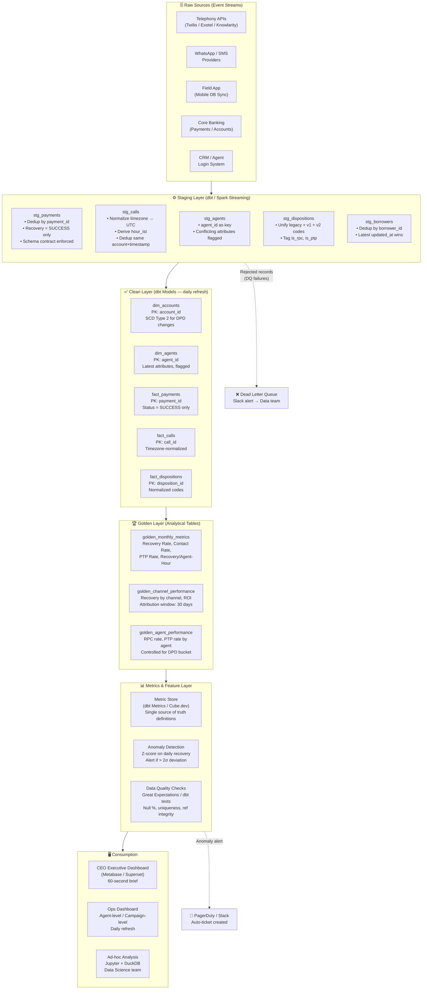

# Production Analytics Architecture

## Overview

This diagram describes the end-to-end data pipeline that should power the collections analytics system in production. Every layer has defined contracts, quality gates, and monitoring hooks.

---

## Key Design Decisions

### Data Contracts
- Each source system must publish a JSON Schema for every event type.
- Schema version changes (`v1` → `v2`) must bump a `schema_version` field **and** trigger a mapping update in `stg_dispositions` before going live.
- Payment events must carry a unique `payment_id`; retries must reuse the same `payment_id`. `payment_reference` is not unique in this data (3,407 references are shared by different accounts) and must never be used as a key.

### Primary Keys
| Table | Primary Key | Uniqueness Guarantee |
|-------|-------------|---------------------|
| `fact_payments` | `payment_id` | Enforced via UPSERT |
| `fact_calls` | `call_id` | Enforced via UPSERT |
| `dim_agents` | `agent_id` | Operational key; employee_code/name unreliable until fixed at source |
| `dim_accounts` | `account_id` | Source system guarantee |
| `fact_dispositions` | `disposition_id` | Enforced via UPSERT |

### Incremental Processing & Late-Arriving Data
- All `fact_*` tables use **incremental dbt models** partitioned by `event_at` date.
- **Late-arriving window**: 7 days. Any event arriving with `event_at` older than 7 days triggers a **targeted backfill** of that partition only.
- Payments are considered final after **3 days** post-event (reversal window). `REVERSED` status events arriving within 3 days update the original record.

### Metric Definitions (Source of Truth)
| Metric | Numerator | Denominator | Notes |
|--------|-----------|-------------|-------|
| **Paying-account rate** | Unique accounts with SUCCESS payment | All accounts in `accounts` | Targeting-based denominators describe different accounts from the payers |
| **Contact Rate (RPC)** | Calls with `is_rpc = TRUE` disposition | Unique accounts with ≥1 call attempt | Per account, not per call |
| **PTP Rate** | Accounts with `PTP_MADE` disposition | Accounts with RPC contact | Only meaningful relative to contacted accounts |
| **PTP Kept Rate** | `promises_to_pay` with `status = 'KEPT'` | All PTPs made in same month | Measures follow-through quality |
| **Recovery per Agent-Hour** | Total recovered (₹) | Agent hours from `agent_sessions` (login→logout) | Exclude sessions >12h (likely forgot to log out) |

### Monitoring & Anomaly Detection
- **Daily Z-score alert**: If total daily recovery deviates > 2σ from the 30-day rolling average, auto-create a Slack alert and ticket.
- **Duplicate rate monitor**: If `COUNT(*) / COUNT(DISTINCT payment_id) > 1.05` in any batch, halt ingestion and alert. Also alert if a `payment_id` appears with two different accounts or amounts.
- **Timezone sentinel**: If any new vendor sends >5% of calls in a new timezone value, flag for mapping update.
